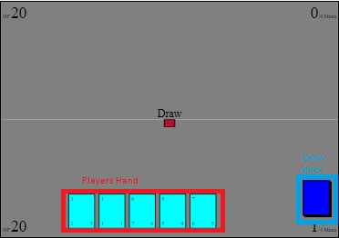
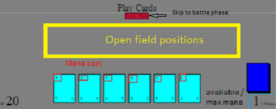
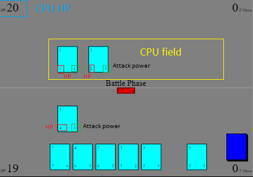

# cardgame
A Hearthstone type card game made with jquery, js, css, and html  
I made this while learning JQuery  

### Draw phase  
  
Click the dark blue deck to draw a card, or pick a card in your hand to discard  
If you cant draw and dont want to discard you can press the red skip button in the center  
### Play cards phase
  
If you have enough available mana click a card to play and then click on an open field position  
If you cant play anymore cards press the red battle phase button to start the battle phase  
  
### Battle phase  
   
During the battle phase click on a card in your field and then click a space in the CPU field to attack  
The number in the bottom left of a card is its HP, bottom right number is it's attack power  
If you attack an empty spot it will do direct damage to the CPU  
Remember you can't attack with a card on the same turn it was played
If you can't attack anymore press the red CPU turn buttton to end your turn  
  
    
[Check-it-out](https://dstnmyrs99.github.io/cardgame) 
